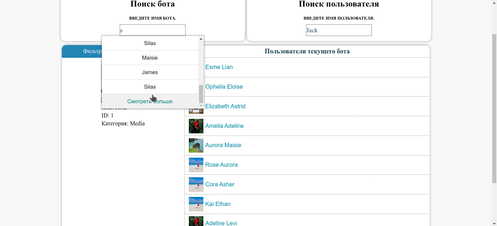
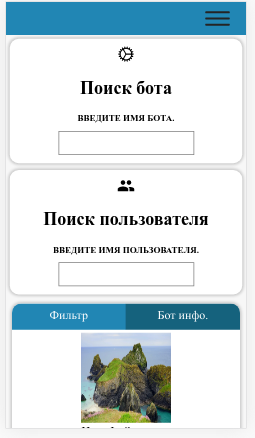

## Frontend Engineer — тестовое задание
    
[Ссылка на тестовое задание](https://paper.dropbox.com/doc/Frontend-Engineer-GFOYvLYpCLWUJe59Ydfmw)

[Демо](https://admin-panel-01.herokuapp.com/)

Откуда узнал о ТЗ?   [Github->Hexlet](https://github.com/Hexlet/ru-test-assignments)

#### UI

##

##

#### Чек-лист решения

- [x] Отображение списка пользователей бота.
- [x] Для каждого пользователя отображается аватар и имя.
- [x] Строка ввода поискового запроса. 
- [x] Поиск осуществляется по имени пользователя.
- [x] ( Pagination ) В одном боте может быть больше миллиона пользователей.
- [x] Фильтр поиска.
- [x] Поиск срабатывает при написании текста.

#### Бонусы

- [x] Адаптивная кроссбраузерная верстка.
- [x] Бэкенд приложение.
- [x] База данных с сотнями пользователей и ботов.
- [ ] Юнит и интеграционные тесты.

#### Frontend
 
* **Webpack:** Сконфигурирован вручную.
* **Typescript:** Для статической типизации + для преобразования финальных js файлов для более старых браузеров (аналог babel).
* **React:** Базовая библиотека для фронтенда в текущем проекте.
* **Redux:** Библиотека для работы с потоком данных + частично с бизнес логикой.
* **Redux Saga:** Библиотека для работы с асинхронным потоком данных + частично с бизнес логикой.
* **Sass + Postcss:** Удобный препроцессор для стилей + кроссбраузерность + оптимизация. 
* **Normalize.css:** Cовременная, готовая к HTML5.
* **Linter + Prettier:** Статический анализ кода.

#### Backend
 
* **Spring framework:** Java фреймворк для веб приложений.
* **Web flux:** Веб приложения в реактивном стиле.
* **R2DBC:** Работа с базой данных в реактивном стиле.
* **Postgres:** СУБД для текущего проекта.
* **Flyway:** Инструмент для миграции баз данных.

